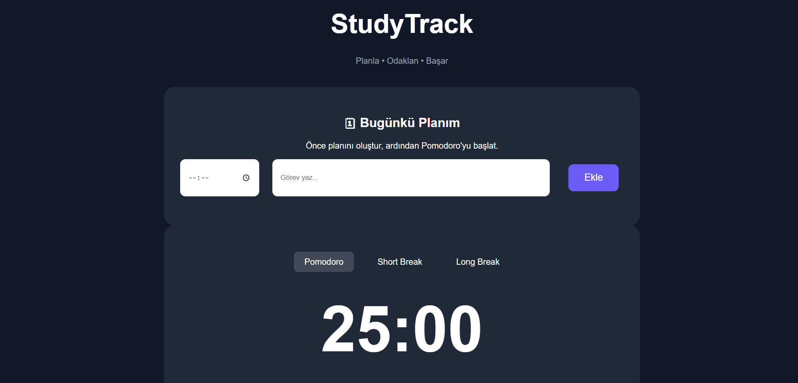
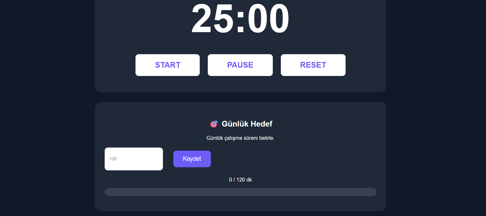
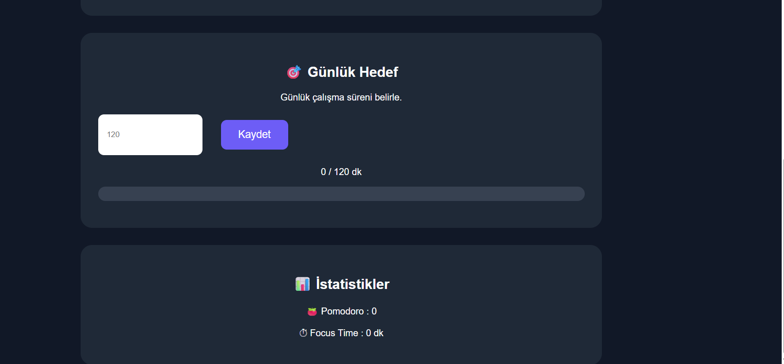
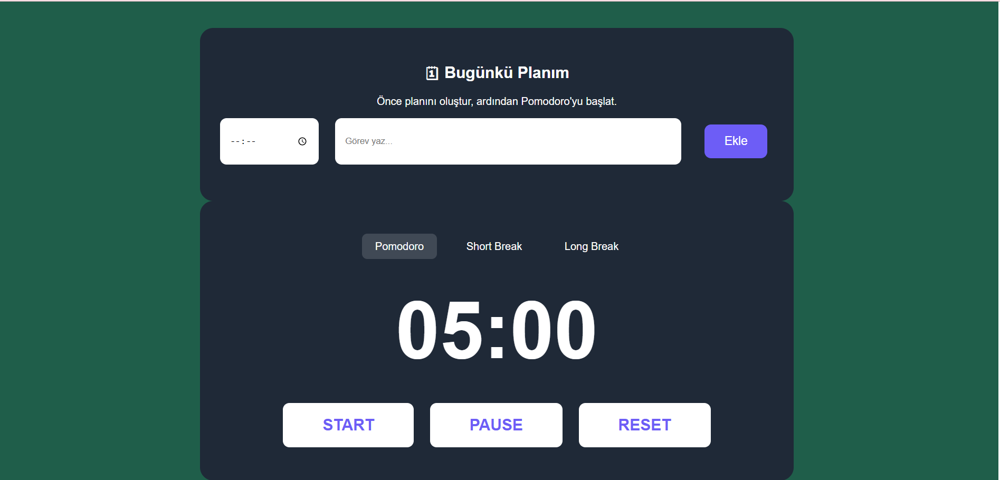
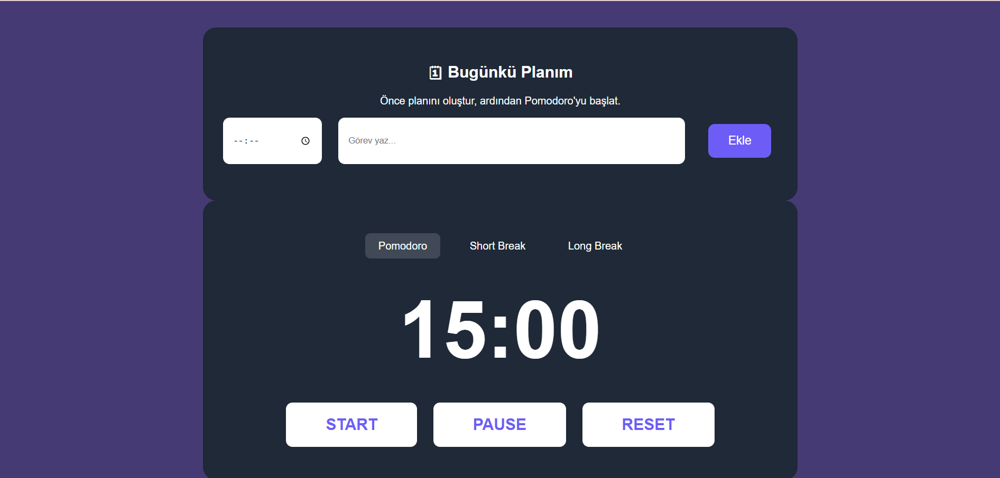

# 📚 StudyTrack Web

HTML, CSS ve JavaScript kullanılarak geliştirilen **StudyTrack Web**, öğrencilerin çalışma süreçlerini planlamalarına, Pomodoro tekniği ile odaklanmalarına ve günlük hedeflerini takip etmelerine yardımcı olan web tabanlı bir çalışma yönetim uygulamasıdır.

---

## 📖 Proje Hakkında

StudyTrack Web; günlük görev planlama, Pomodoro zamanlayıcısı, kısa ve uzun mola modları, günlük çalışma hedefi belirleme ve çalışma istatistiklerini takip etme özelliklerini tek bir arayüzde sunmaktadır.

Uygulamadaki veriler **Local Storage** kullanılarak tarayıcı üzerinde saklanır. Böylece sayfa yenilense bile kullanıcı verileri korunur.

---

## 📷 Uygulama Görselleri

### 🏠 Ana Sayfa

---

### 🍅 Pomodoro Sayacı

---

### 🎯 Günlük Hedef

---

### ☕ Kısa Mola Modu

---

### 🌙 Uzun Mola Modu

---

## 🚀 Özellikler

- 🍅 Pomodoro Sayacı
- ☕ Kısa Mola (Short Break)
- 🌙 Uzun Mola (Long Break)
- 📝 Günlük Çalışma Planlayıcısı
- 🎯 Günlük Çalışma Hedefi
- 📊 Çalışma İstatistikleri
- 💾 Local Storage ile veri kaydetme
- 🎨 Modern ve kullanıcı dostu arayüz

---

## 🛠️ Kullanılan Teknolojiler

| Teknoloji | Açıklama |
|-----------|----------|
| HTML5 | Sayfa yapısı |
| CSS3 | Arayüz tasarımı |
| JavaScript | Uygulama mantığı |
| Local Storage API | Verilerin tarayıcıda saklanması |

---

## 🎯 Projenin Amacı

Bu proje, öğrencilerin ders çalışma alışkanlıklarını geliştirmelerine yardımcı olmak amacıyla geliştirilmiştir.

Kullanıcılar uygulama sayesinde;

- Günlük çalışma planı oluşturabilir.
- Pomodoro tekniği ile odaklanma süresini yönetebilir.
- Günlük çalışma hedefi belirleyebilir.
- Çalışma istatistiklerini takip edebilir.
- Çalışma verilerini tarayıcı üzerinde güvenli şekilde saklayabilir.

---

## 💡 Öğrenilen Kazanımlar

Bu proje geliştirilirken aşağıdaki konularda deneyim kazanılmıştır.

- DOM Manipülasyonu
- Event (Olay) Yönetimi
- JavaScript Fonksiyonları
- Local Storage Kullanımı
- Responsive tasarım mantığı
- CSS Flexbox
- Zamanlayıcı (setInterval / clearInterval)
- Kullanıcı deneyimi (UI/UX) geliştirme

---

## 🔄 Geliştirilmesi Planlanan Özellikler

- 📅 Haftalık ve aylık çalışma raporları
- 📈 Grafik destekli analiz ekranı
- 📱 Responsive (mobil uyumlu) tasarım
- 🔔 Bildirim sistemi
- 🔊 Ses efektleri
- 🌗 Açık / Koyu tema desteği
- ✅ Görev tamamlama sistemi
- 👤 Kullanıcı hesabı oluşturma
- ☁️ Bulut tabanlı veri senkronizasyonu

---

## 👩‍💻 Geliştirici

**Beyzanur Aysel**

🎓 Mersin Üniversitesi  
**Bilişim Sistemleri ve Teknolojileri**

---

## ⭐ Not

Bu proje, web teknolojileri kullanılarak geliştirilen kişisel bir çalışma yönetim uygulamasıdır. Geliştirme süreci devam etmekte olup yeni özellikler eklenmeye devam edecektir.
